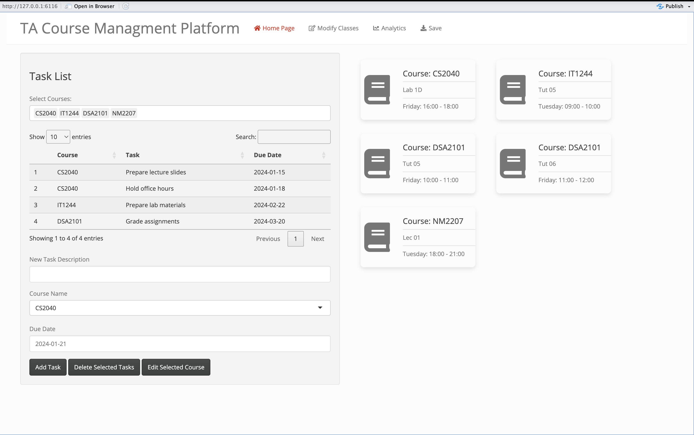
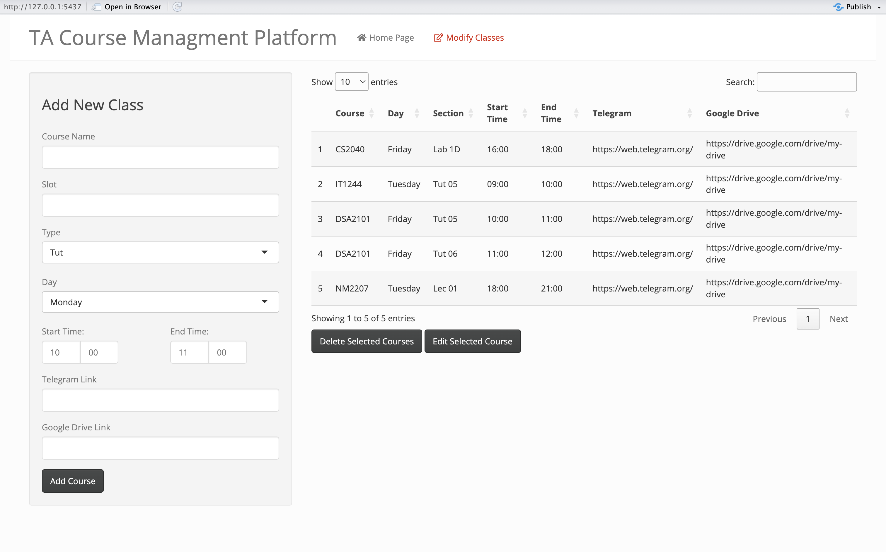
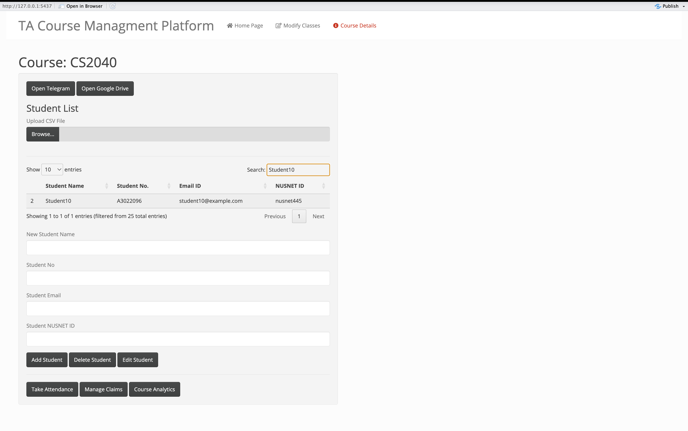
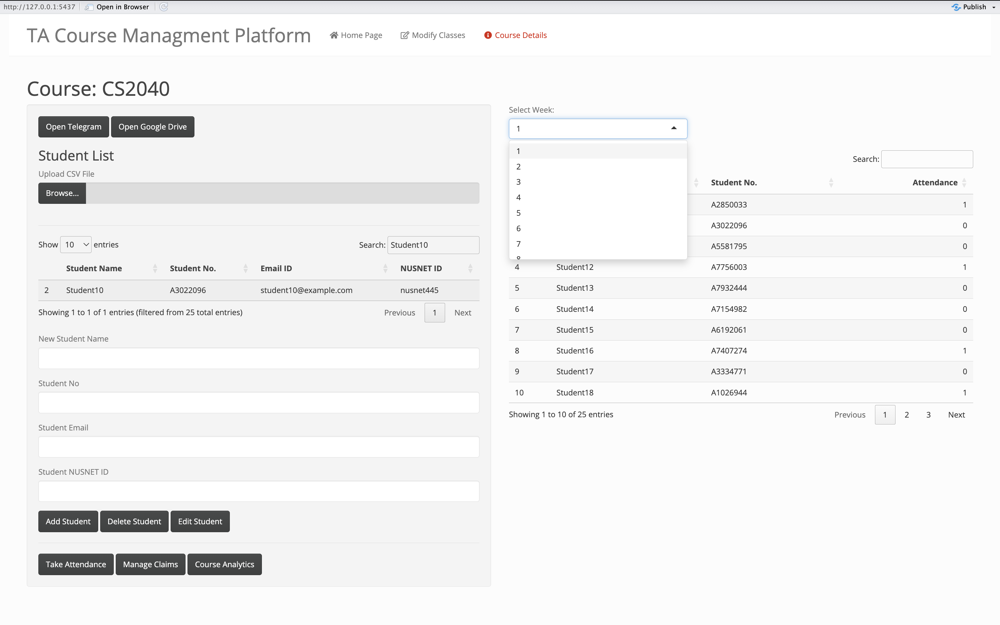
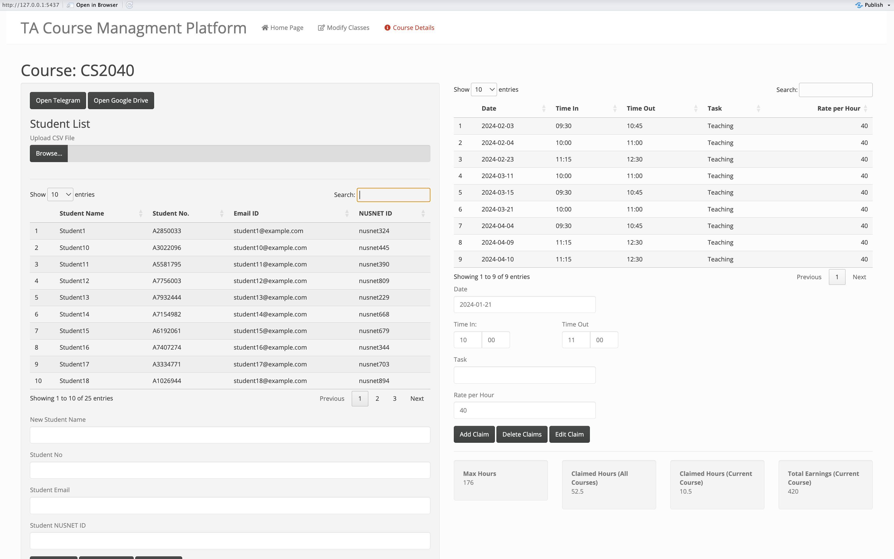
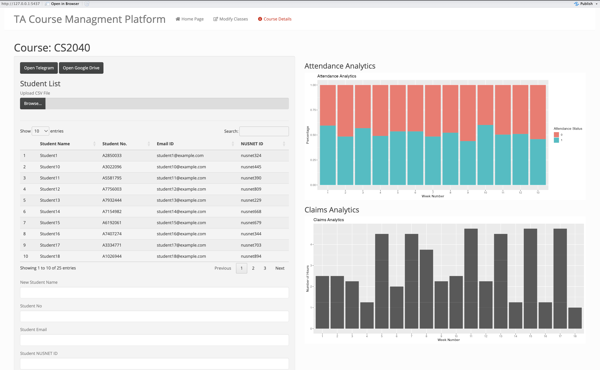

# TA-Course-Management-Shiny-HNR

This Shiny app is designed to provide a platform for managing student attendance, claims, and analytics for courses, specificlaly designed for TAs at NUS. It allows easy tracking of student data, attendance records, and claims information.

## Project Structure

- `HackNRoll.Rproj`: RStudio project file.
- `app.R`: Main file containing the Shiny app code.
- `helper.R`: Helper functions for data manipulation or other utility functions.
- `ui.R`: User interface definition.
- `server.R`: Server logic for the Shiny app.
- `README.md`: Documentation file.
- `data.R`: File for data preprocessing and generation.
- `www/`: Directory for storing static files like images or stylesheets.

## Getting Started

To run the Shiny app locally, make sure you have R and RStudio installed. Open the `HackNRoll.Rproj` file in RStudio, and run the `app.R` file.

```R
# Install required packages
install.packages(c("shiny", "shinythemes", "shinyWidgets", "shinyTime", "DT", "tidyverse", "stringr", "lubridate", "shinydashboard", "shinyjs", "plotly", "ggplot2", "shinyFiles"))


# Run the app
shiny::runApp()
```

## Features

### 1. Task Management
Effortlessly stay on top of your course workload by tracking tasks and deadlines. Dive into the Home Page for a sleek overview of all your courses.


### 2. Course Management
Take control of your teaching assistant role with the power to add, delete, and finesse the details of the courses you're TA-ing.


### 3. Student Management
Craft an organized academic realm by seamlessly adding, deleting, and refining student information for each course.


### 4. Attendance Tracking
Take attendance for different weeks and mark students as present, absent, or other.


### 5. Claims Management
Harness the potential of a structured workflow by managing claims for various tasks, complete with date, time, and task details.


### 6. Analytics
Elevate your insights game with analytics that not only unravel attendance patterns and claims but also present them in captivating visualizations powered by ggplot.



## Required Packages

- `shiny`: Main package for building Shiny web applications.
- `shinythemes`: Additional themes for Shiny apps.
- `shinyWidgets`: Custom widgets and components for Shiny apps.
- `shinyTime`: Time input widgets for Shiny apps.
- `DT`: Interactive tables for Shiny apps.
- `tidyverse`: Collection of packages for data manipulation and visualization.
- `stringr`: String manipulation functions.
- `lubridate`: Date and time manipulation functions.
- `shinydashboard`: Dashboard framework for Shiny apps.
- `shinyjs`: JavaScript functions for Shiny apps.
- `plotly`: Interactive plots for Shiny apps.
- `ggplot2`: Grammar of Graphics for creating static plots.
- `shinyFiles`: File input and output widgets for Shiny apps.

## Data

- `courses_df`: Dataframe containing information about different courses.
- `attendance_df`: Dataframe for storing attendance records.
- `claims_df`: Dataframe for managing claims information.
- `todo_df`: Dataframe with tasks and deadlines.

## License
This project is licensed under the MIT License - see the LICENSE file for details.


